# GridPulse

> Real-time IoT monitoring platform for smart grid infrastructure

[](https://github.com/Ammari-Youssef/GridPulse/actions)
[](https://www.oracle.com/java/)
[](https://angular.io/)
[](https://spring.io/projects/spring-boot)

A full-stack energy grid monitoring and management application built with Angular and Spring Boot. This project demonstrates modern enterprise development practices including containerization, database migrations, CI/CD pipelines, and comprehensive testing strategies.

---

## 🎥 Demo

> **Note:** This project includes full deployment configuration for Railway (backend) and Vercel (frontend). Live deployment paused for cost optimization. See screenshots below or run locally with Docker.

### Screenshots

<details>
<summary>🔐 Authentication</summary>

#### Login with Demo Credentials

*Secure authentication with demo account access*

</details>

<details>
<summary>📊 Dashboard & Monitoring</summary>

#### Dashboard Overview
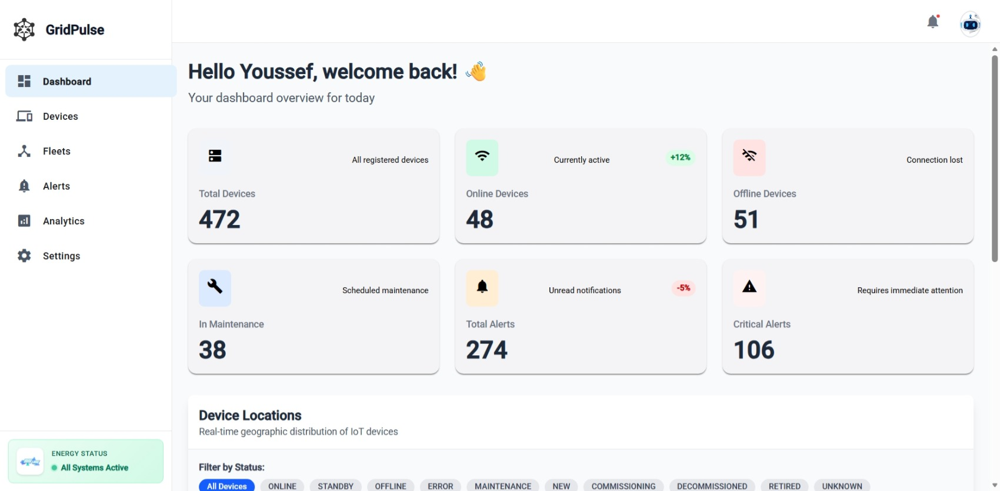
*Real-time device monitoring with key metrics*

#### Interactive Map View
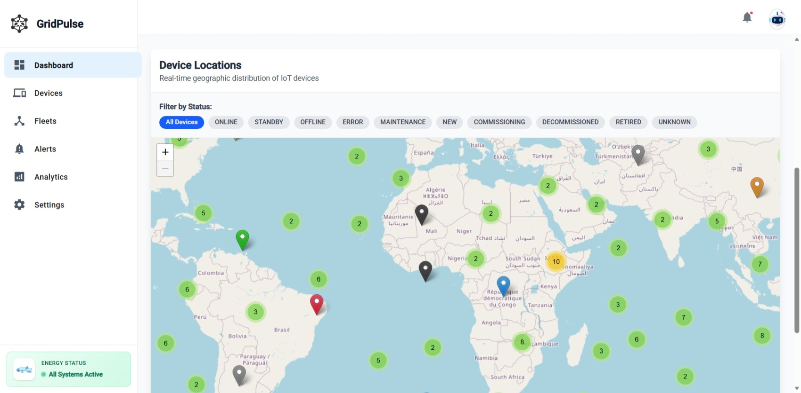
*Geolocation tracking of all devices*

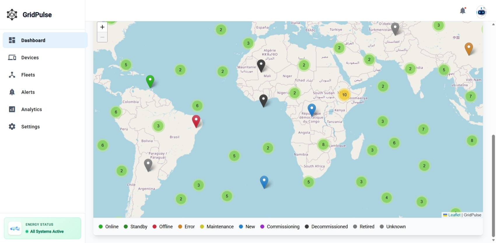
*Device clustering and selection*

#### Map Filtering
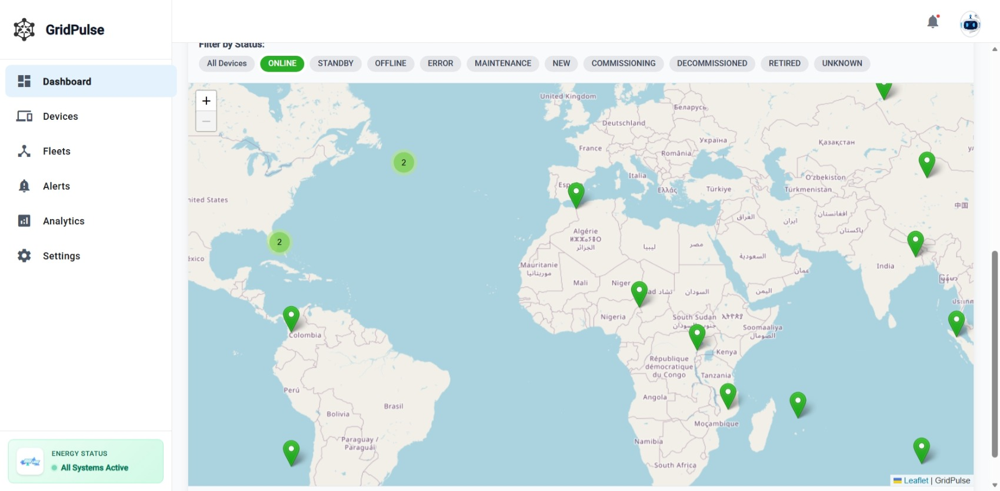
*Advanced filtering capabilities*

</details>

<details>
<summary>🔋 Device Management</summary>

#### Device List
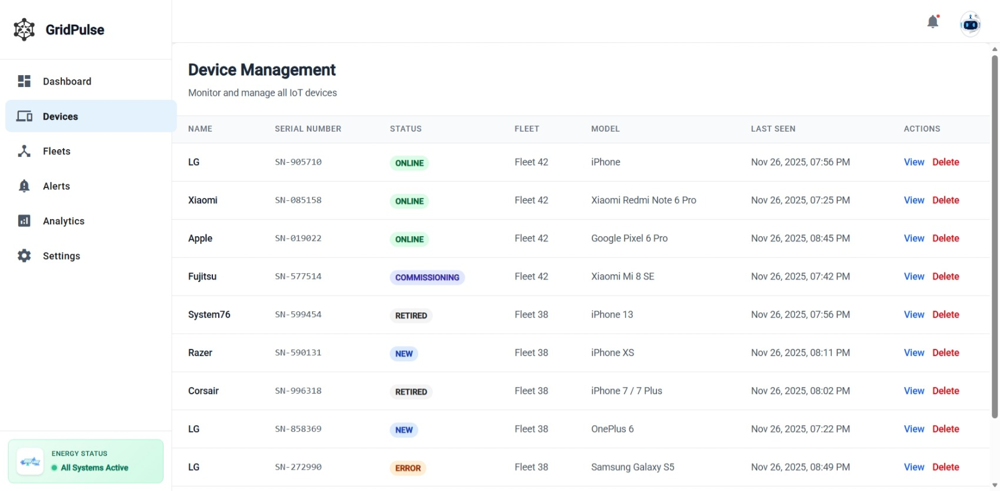
*Paginated device inventory with search and filters*

#### Device Details
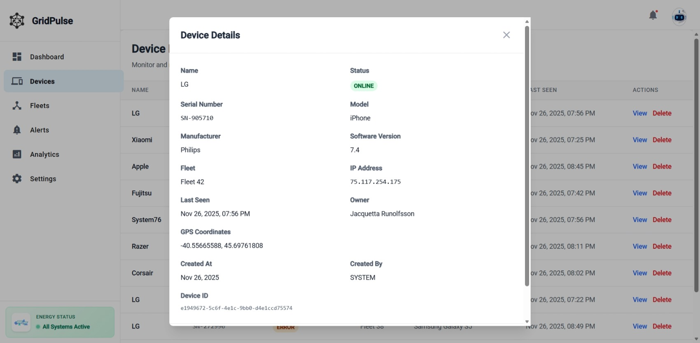
*Comprehensive device information including BMS, Meter, and Inverter data*

</details>

<details>
<summary>📈 Analytics</summary>

#### Analytics Overview
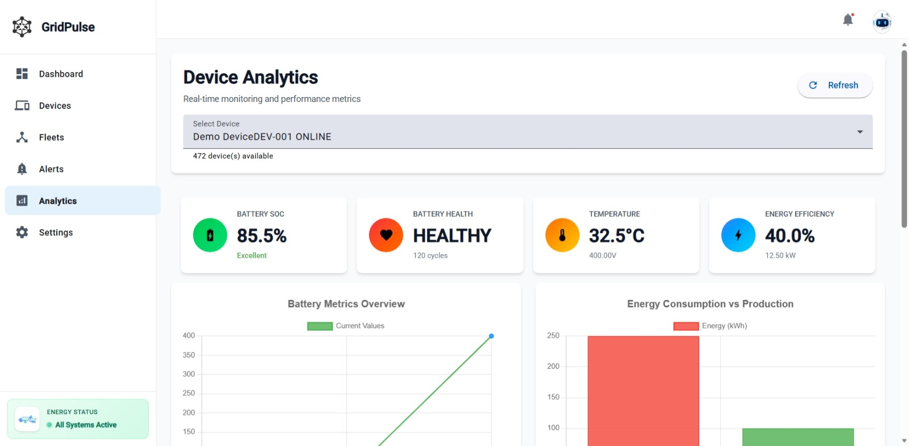
*Device performance metrics and trends*

#### Device Selector
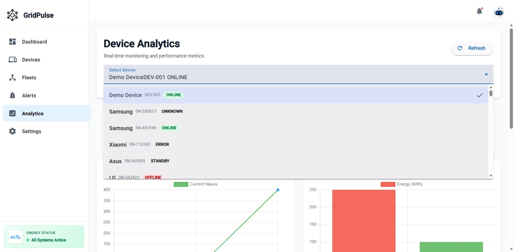
*Multi-device comparison interface*

#### Battery Health Monitoring
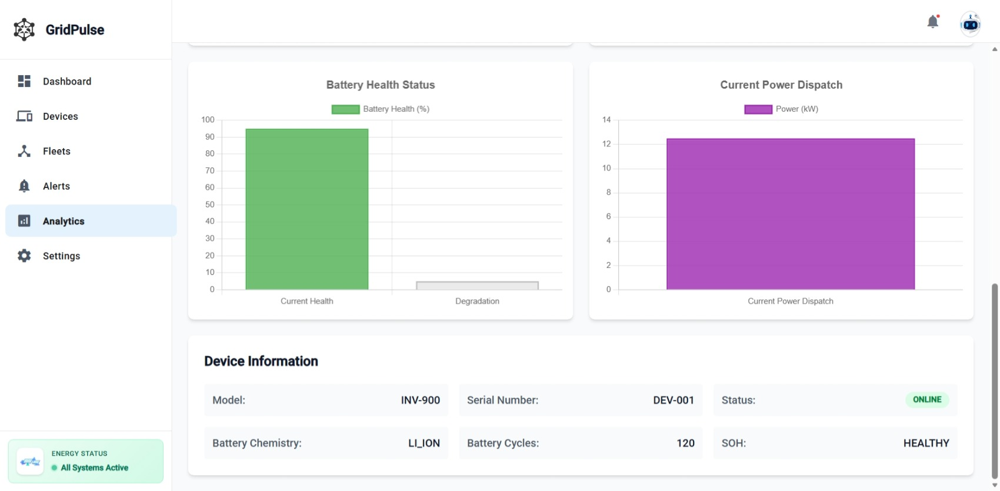
*State of Health (SOH) and power dispatch metrics*

#### Consumption Metrics
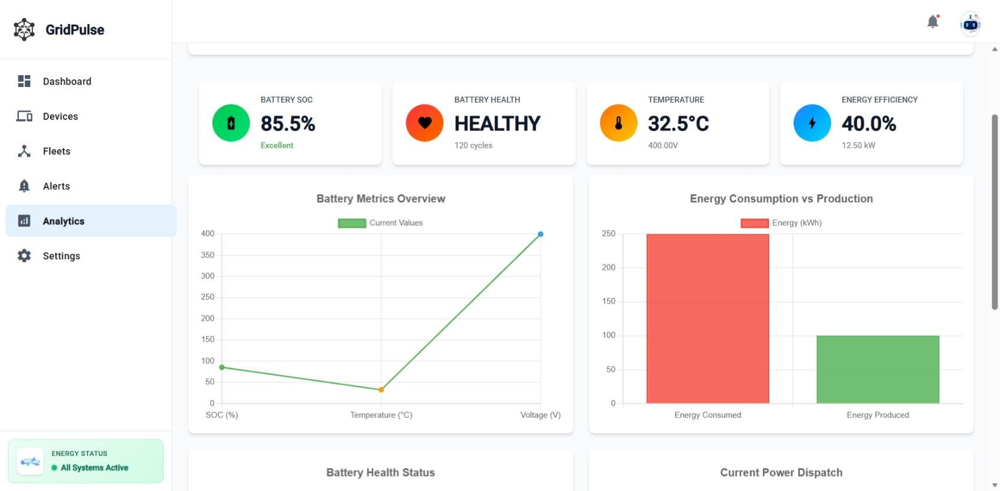
*Energy consumption and production analysis*

</details>

<details>
<summary>🚨 Alerts & Notifications</summary>

#### Alerts List

*System alerts and warnings dashboard*

#### Alert Details
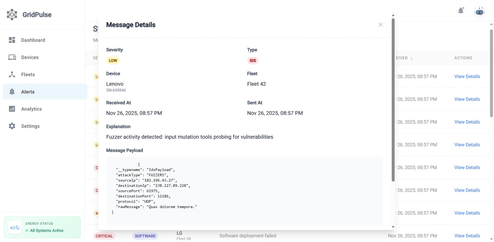
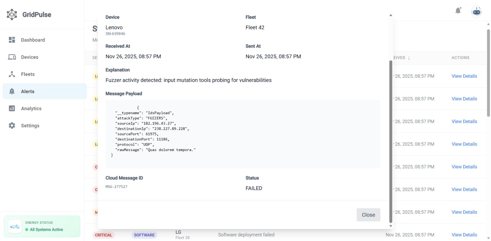
*Detailed alert information and resolution tracking*

#### Notifications

*Real-time notification center*

</details>

<details>
<summary>🏢 Fleet Management</summary>

#### Fleets List

*Organization-level fleet overview*

#### Fleet Pagination

*Paginated fleet browsing*

#### Fleet Details
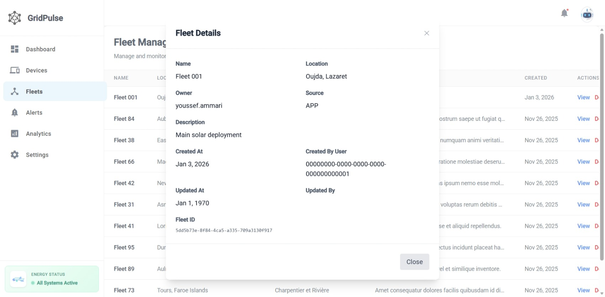
*Individual fleet management and device assignment*

</details>

<details>
<summary>👥 User Management & Settings</summary>

#### User Management
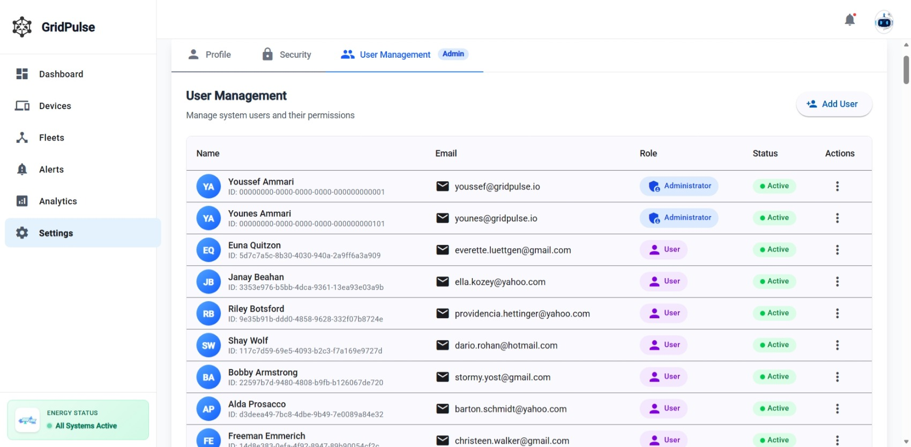
*Role-based user administration*

#### Profile Settings
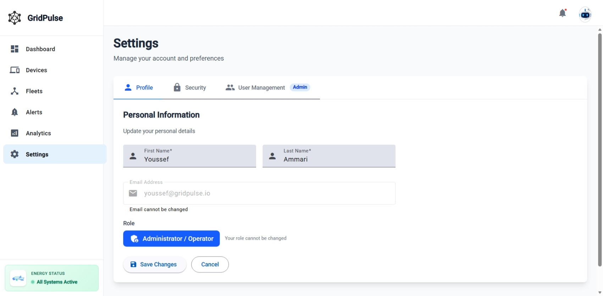
*User profile configuration*

#### Security Settings
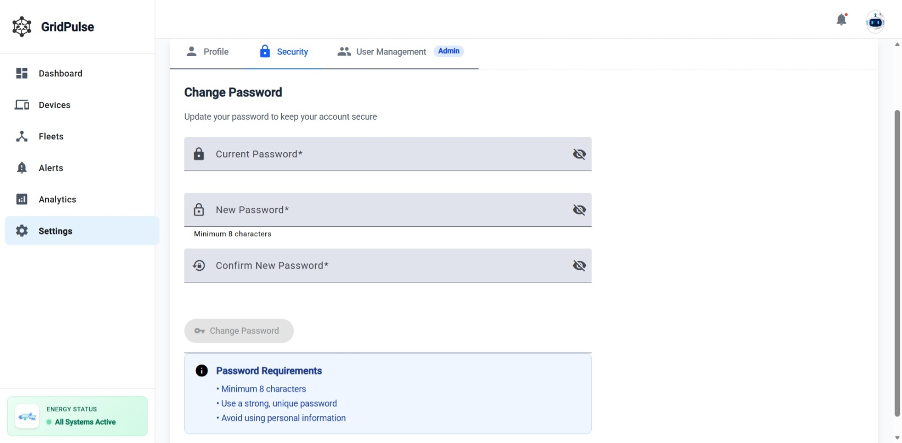
*Password and authentication management*

#### Profile Menu
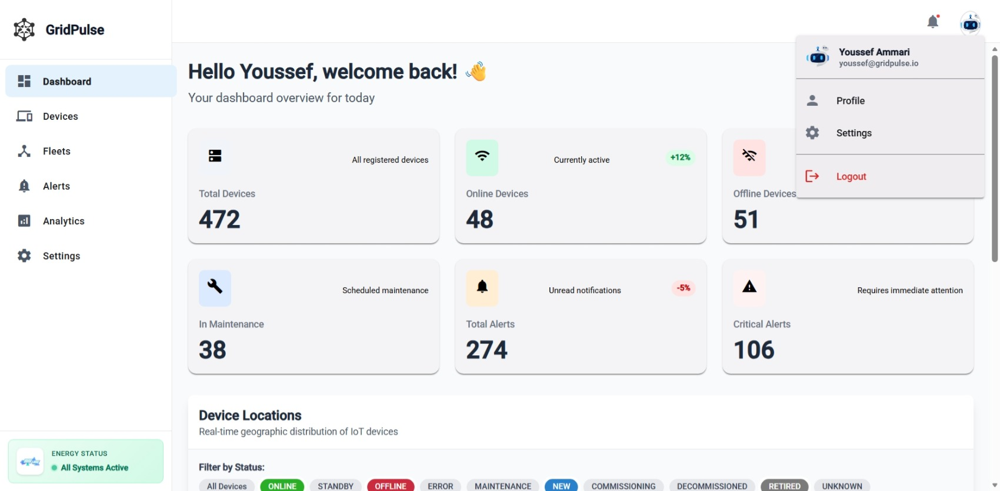
*Quick access navigation*

</details>

---

### 💻 Run Locally
```bash
# Clone repository
git clone https://github.com/Ammari-Youssef/GridPulse.git
cd GridPulse

# Start all services with Docker
docker-compose up --build

# Access the application
# Frontend: http://localhost:4200
# Backend API: http://localhost:8080
# PostgreSQL: localhost:5432
```

**Demo Credentials:**
```
Email: youssef@gridpulse.io
Password: ysf@1234
Role: Admin (full access to all features)
```

---

## 🚀 Tech Stack

### Frontend
- **Angular 19** - Modern web framework with standalone components
- **Angular Material** - Material Design UI components
- **TailwindCSS 4** - Utility-first styling
- **Apollo GraphQL** - Efficient API data fetching
- **Leaflet** - Interactive map visualization
- **TypeScript** - Type-safe development

### Backend
- **Spring Boot 3.4.5** - Production-grade Java framework
- **PostgreSQL** - Relational database
- **Liquibase** - Version-controlled database migrations
- **Spring Security + JWT** - Secure authentication & authorization
- **GraphQL** - Flexible API query language
- **Maven** - Dependency management & build automation

### DevOps & Quality
- **Docker & Docker Compose** - Containerization
- **GitHub Actions** - CI/CD automation
- **JUnit & Mockito** - Unit testing
- **Testcontainers** - Integration testing with real databases
- **JaCoCo** - Code coverage reporting
- **SonarQube** - Static code analysis

---

## 🏗️ Project Structure
```
GridPulse/
├── backend/              # Spring Boot API (Java 17)
│   ├── src/
│   │   ├── main/
│   │   │   ├── java/           # Application code
│   │   │   └── resources/
│   │   │       ├── db/changelog/  # Liquibase migrations
│   │   │       ├── application.yml
│   │   │       └── application-prod.yml
│   │   │       └── application-dev.yml
│   │   │       └── application-seed.yml
│   │   │       └── application-docker.yml
│   │   └── test/               # Unit & integration tests
│   ├── Dockerfile
│   └── pom.xml
├── frontend/             # Angular 19 SPA
│   ├── src/
│   │   ├── app/
│   │   │   ├── core/           # Services, guards, interceptors
│   │   │   ├── features/       # Feature modules
│   │   │   ├── shared/         # Shared components
│   │   │   └── layout/         # Layout components
│   │   ├── environments/       # Environment configs
│   │   └── assets/
│   ├── Dockerfile
│   ├── package.json
│   └── angular.json
├── docs/
│   ├── screenshots/      # Application screenshots
│   ├── DEPLOYMENT.md     # Deployment guide (Railway/Vercel)
│   ├── ARCHITECTURE.md   # Application system design
│   ├── API.md   # GraphQL API documentation
│   └── message-payloads/ # Alert message examples
├── .github/workflows/    # CI/CD pipelines
├── docker-compose.yml
└── README.md
```

---

## ⚡ Quick Start

### Prerequisites
- Node.js 18+
- Java 17+
- Maven 3.8+
- Docker & Docker Compose

### Development Setup

**1. Clone the repository:**
```bash
git clone https://github.com/Ammari-Youssef/GridPulse.git
cd GridPulse
```

**2. Start with Docker (Recommended):**
```bash
docker-compose up --build
```

**3. Or run services separately:**

**Backend:**
```bash
cd backend
mvn clean install
mvn spring-boot:run
```

**Frontend:**
```bash
cd frontend
npm install
ng serve
```

**Access:**
- Frontend: http://localhost:4200
- Backend API: http://localhost:8080/graphql
- GraphiQL: http://localhost:8080/graphiql

---

## 🧪 Testing

### Backend Tests
```bash
cd backend

# Run all tests
mvn test

# Run with coverage
mvn clean verify

# View coverage report
open target/site/jacoco/index.html
```

### Frontend Tests
```bash
cd frontend

# Run unit tests
ng test

# Run with coverage
ng test --code-coverage
```

---

## 🔨 Building for Production

### Docker Build
```bash
docker-compose up --build
```

### Manual Build

**Backend:**
```bash
cd backend
mvn clean package -DskipTests
# Output: target/gridpulse-backend-*.jar
```

**Frontend:**
```bash
cd frontend
ng build --configuration production
# Output: dist/gridpulse/browser/
```

---

## 🚀 Deployment

This project includes full deployment configuration for:
- **Backend + Database:** Railway
- **Frontend:** Vercel

**See [docs/DEPLOYMENT.md](docs/DEPLOYMENT.md) for complete setup instructions.**

---

## ✨ Key Features

- ✅ **Real-time Monitoring** - Live device status and metrics
- ✅ **Interactive Maps** - Geolocation tracking with clustering
- ✅ **Advanced Analytics** - Historical data visualization
- ✅ **Alert Management** - Configurable alerts and notifications
- ✅ **Fleet Management** - Organize devices into fleets
- ✅ **User Management** - Role-based access control (Admin/User)
- ✅ **Responsive Design** - Mobile-friendly interface
- ✅ **GraphQL API** - Efficient data fetching
- ✅ **Database Migrations** - Version-controlled schema changes
- ✅ **Secure Authentication** - JWT-based auth with refresh tokens

---

## 🔐 Environment Configuration

### Local Development
Uses `environment.development.ts` (localhost)

### Production
Uses `environment.production.ts` (deployed URLs)

See individual service READMEs for detailed configuration:
- [Backend Configuration](backend/README.md)
- [Frontend Configuration](frontend/README.md)

---

## 🐛 Troubleshooting

### Port Conflicts
```bash
docker-compose down
# Edit docker-compose.yml to change ports
docker-compose up
```

### Database Reset
```bash
docker-compose down -v
docker-compose up --build
```

### Build Issues
```bash
# Backend
cd backend && mvn clean

# Frontend
cd frontend && rm -rf node_modules && npm install
```

---

## 📚 Documentation

- [Deployment Guide](docs/DEPLOYMENT.md) - Railway & Vercel deployment
- [API Documentation](docs/API.md) - GraphQL schema & queries
- [Architecture Overview](docs/ARCHITECTURE.md) - System design & tech stack

---

## 🤝 Contributing

This is a portfolio project demonstrating full-stack development capabilities. Feedback and suggestions are welcome!

1. Fork the repository
2. Create a feature branch
3. Commit your changes
4. Open a Pull Request

---

## 📄 License

This project is part of my portfolio and is available for educational purposes.

---

## 👤 Author

**Youssef Ammari**

- GitHub: [@Ammari-Youssef](https://github.com/Ammari-Youssef)
- Email: youssef.ammari.795@gmail.com
- LinkedIn: [Youssef Ammari](https://linkedin.com/in/youssef-ammari)

---

**Built with ❤️ to demonstrate modern full-stack development practices**

*Last Updated: January 2026*