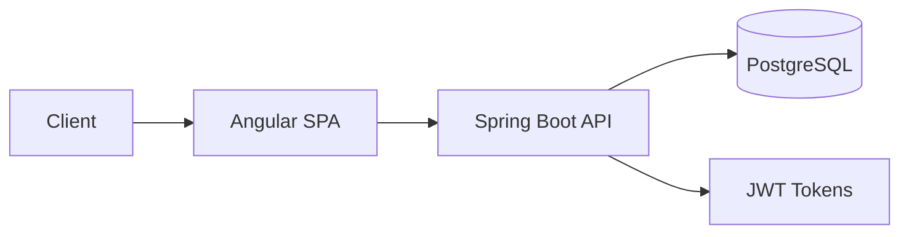

# Architecture Overview

## System Design

## Tech Stack
- Frontend: Angular SPA
- Backend: Spring Boot GraphQL API
- Database: PostgreSQL
- Auth: JWT tokens

## Key Design Decisions
- Monolithic architecture
- GraphQL for flexible data fetching
- Liquibase for database versioning
- Docker for consistent environments
